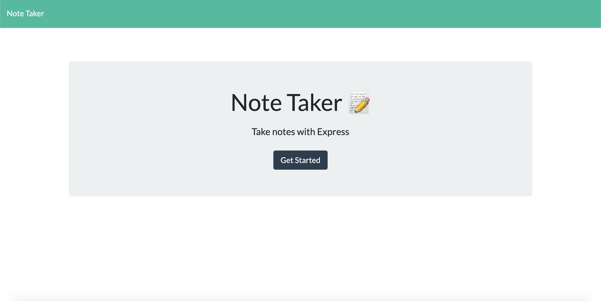
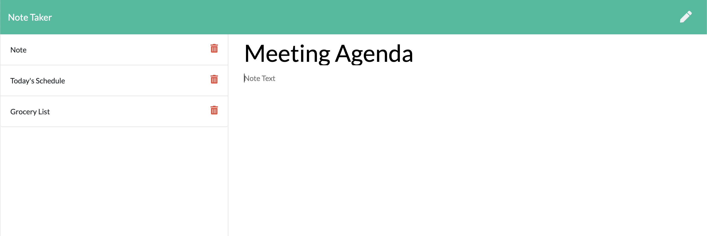

# Note Taker Application

> Online users who need to keep track of certain information may seek an efficient way to have their written information available when needed. This note taker application uses JavaScript, Node.js, and Express to allow users to write and save notes, as well as delete the notes when needed.

## Table of Contents

 * [Description](#description)
  * [Usage](#usage)
  * [Screenshots](#screenshots)
  * [License](#license)
  * [Questions](#questions)

## Description

For many users, especially ones working at the computer for long periods of time, it is necessary to remember large amounts of information and new tasks. The Note Taker provides a way for these users to write notes, give these notes a title, and save them to the application. Users can access any note they have previously written by clicking on the note in the sidebar, and they can delete notes if they no longer need them. The application uses JavaScript, Node.js, the node packages Express and Nodemon, Bootstrap CSS, and FontAwesome Icons to create efficient note taking technology readily available to users.

## Usage

You can view this application at https://mw-note-taker-app.herokuapp.com/. 

When you open the application to the index page, click the button that reads "Get Started" in order to be brought to the note-taking page. Once there, you can type in your notes. When you are done typing in your note, you can click the "save" icon to save your note to the program. You can save as many notes as you would like. If you want to delete a note, you can click on the trash can icon next to the note and it will be deleted.

## Screenshots

Opening page of the application

Page where users can enter a note 

An example of where multiple notes have been entered

## License

Copyright 2020 Maria Waslick

Permission is hereby granted, free of charge, to any person obtaining a copy of this software and associated documentation files (the "Software"), to deal in the Software without restriction, including without limitation the rights to use, copy, modify, merge, publish, distribute, sublicense, and/or sell copies of the Software, and to permit persons to whom the Software is furnished to do so, subject to the following conditions:

The above copyright notice and this permission notice shall be included in all copies or substantial portions of the Software.

THE SOFTWARE IS PROVIDED "AS IS", WITHOUT WARRANTY OF ANY KIND, EXPRESS OR IMPLIED, INCLUDING BUT NOT LIMITED TO THE WARRANTIES OF MERCHANTABILITY, FITNESS FOR A PARTICULAR PURPOSE AND NONINFRINGEMENT. IN NO EVENT SHALL THE AUTHORS OR COPYRIGHT HOLDERS BE LIABLE FOR ANY CLAIM, DAMAGES OR OTHER LIABILITY, WHETHER IN AN ACTION OF CONTRACT, TORT OR OTHERWISE, ARISING FROM, OUT OF OR IN CONNECTION WITH THE SOFTWARE OR THE USE OR OTHER DEALINGS IN THE SOFTWARE.

## Questions

If you have additional questions, you can contact me through my GitHub profile at [mwaslick](https://github.com/mwaslick), or e-mail me at mariawaslick@gmail.com.
